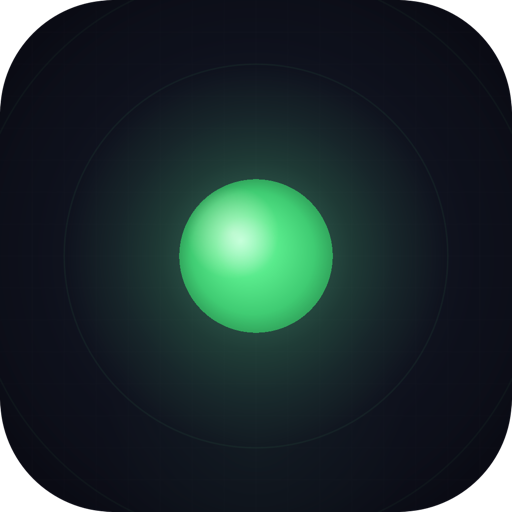
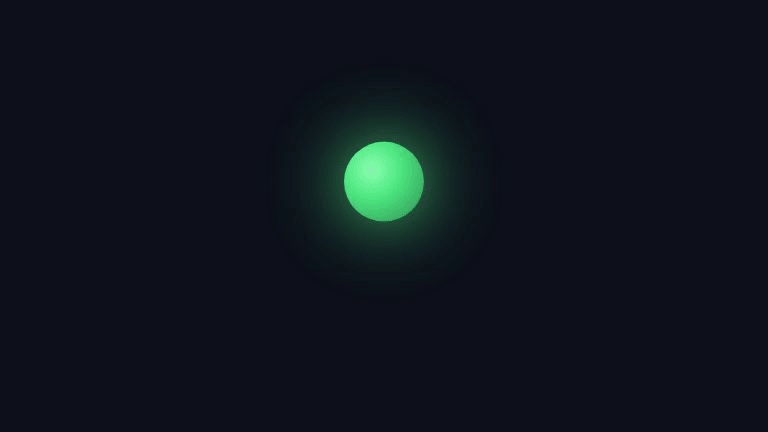

<div align="center">



# Aura

**Your Mac, voice-controlled.**

[](https://www.apple.com/macos/)
[](https://www.rust-lang.org)
[](https://ai.google.dev/)
[](LICENSE)

</div>

<br/>

<div align="center">


[Watch full 60s video →](assets/promo.mp4)
</div>

<br/>

You're deep in work. Twelve tabs open, three apps side by side, a document you need to reference while typing into another window. You reach for the mouse, click, switch, scroll, copy, switch back, paste. Repeat. All day.

**What if you could just say it?**

> *"Open Safari and go to the project board."*
>
> *"Take a look at my screen and summarize what's going on."*
>
> *"Move the mouse to that submit button and click it."*
>
> *"Press Cmd+Shift+4 and take a screenshot."*

Aura is an AI that lives in your menu bar. It hears you, sees your screen, and acts — moving the mouse, typing, clicking, running scripts — all through natural conversation. No keyboard shortcuts to memorize. No workflow apps to configure. Just talk.

Aura speaks with **Kore**, a calm, clear voice from Gemini's native audio model — chosen for its natural cadence in back-and-forth conversation. It doesn't narrate actions or over-explain. It responds the way a competent colleague would: briefly, directly, then acts. When you interrupt mid-sentence, it stops immediately and adapts — conversations feel human, not scripted.

Built on the **Gemini Live API** for real-time bidirectional audio and vision streaming, with **Google Cloud Run** and **Firestore** for persistent cross-session memory.

### Built with

| Google Technology | How Aura uses it |
|---|---|
| **Gemini Live API** | Bidirectional WebSocket for simultaneous audio + vision streaming |
| **Gemini 2.5 Flash** (native audio) | Real-time voice conversation with native speech synthesis |
| **Gemini 3 Flash** | Vision oracle — refines click coordinates from screenshots |
| **Google Search grounding** | Live web answers (weather, news, facts) without leaving the conversation |
| **Cloud Run** | WebSocket proxy relay + memory consolidation agent |
| **Firestore** | Cross-device persistent memory (facts, session summaries) |
| **Gemini ADK** | Powers the memory agent's session consolidation pipeline |

---

## How it works

A small green dot appears in your menu bar. That's Aura, always listening.

When you speak, your voice streams in real-time to Google's Gemini Live API. Aura simultaneously watches your screen at 2 frames per second, so it always knows what you're looking at. When Gemini decides to act, it calls one of Aura's native tools — and your Mac responds instantly.

```
    ┌─────────┐  16kHz audio   ┌─────────────────────┐
    │   You   │ ─────────────→ │                     │
    │  speak  │                │  Gemini Live API    │
    └─────────┘                │  (bidirectional WS) │
                               │                     │
    ┌─────────┐  2 FPS JPEG    │  sees + hears you   │
    │ Screen  │ ─────────────→ │  simultaneously     │
    │ capture │                └──────────┬──────────┘
    └─────────┘                           │
                                 speaks back (24kHz)
                                 OR calls tools
                                          │
                     ┌────────────────────┼────────────────────┐
                     ▼                    ▼                    ▼
               ┌──────────┐        ┌──────────┐        ┌──────────┐
               │  Click   │        │   Type   │        │  Script  │
               │  Scroll  │        │   Keys   │        │  Shell   │
               │  Drag    │        │   Text   │        │  Apps    │
               └──────────┘        └──────────┘        └──────────┘
                     │                    │                    │
                     └────────────────────┼────────────────────┘
                                          ▼
                                   Screen updates
                                   (loop continues)
```

The entire pipeline — voice capture, screen analysis, tool execution — runs as native Rust. No Electron. No browser. No latency from web tech. Just raw speed on bare metal macOS.

## What Aura can do

| | Capability | How it works |
|---|---|---|
| **Talk** | Real-time voice conversation | 16kHz capture, 24kHz playback, barge-in detection |
| **See** | Understands your screen | 2 FPS capture with change detection, reads accessibility labels |
| **Click** | Mouse control | Move, click (left/right, single/double/triple), scroll, drag — coordinate accuracy depends on Gemini's vision |
| **Type** | Keyboard automation | Type text, press shortcuts (Cmd+C, Cmd+V, etc.), special keys |
| **Script** | AppleScript & shell | Control any macOS app — open files, switch tabs, manage windows |
| **Search** | Live web answers | Google Search grounding for real-time facts, weather, news |
| **Ground** | Anti-hallucination | Continuous screen feedback, accessibility data, Search grounding, vision oracle fallback |
| **Remember** | Persistent memory | SQLite-backed session history across restarts |
| **Protect** | Defense-in-depth safety | Shell script blocking, metacharacter rejection, obfuscation detection, terminal app blocking |

## Example commands

```
"Open Finder and go to my Downloads folder."
"What app am I looking at right now?"
"Click the blue button in the top right."
"Type 'meeting notes' into the search bar and press Enter."
"Drag that file to the Desktop."
"Press Cmd+Z to undo."
"Close this window."
```

## Native tools (20)

Gemini calls these through the Live API's function calling protocol. Every tool maps to a native macOS API — no shell wrappers, no browser automation frameworks.

| Category | Tools |
|---|---|
| **Mouse** | `click`, `click_element`, `context_menu_click`, `move_mouse`, `drag`, `scroll` |
| **Keyboard** | `type_text`, `press_key`, `select_text` |
| **Apps** | `activate_app`, `click_menu_item` |
| **Scripts** | `run_applescript`, `run_javascript`, `run_shell_command` |
| **Memory** | `save_memory`, `recall_memory` |
| **Context** | `get_screen_context`, `write_clipboard` |
| **System** | `shutdown_aura`, `key_state` |
| **Web** | Google Search (grounding tool — built into Gemini) |

Tools execute asynchronously (max 8 concurrent). Safe action chains — like click → type → enter — pipeline without screen verification, up to 3 deep with 30ms settle delays.

## Core pipeline

The loop that runs continuously while Aura is active:

```
 1. Mic captures audio, resamples to 16kHz PCM in ~10ms chunks (512-sample sinc resampler)
 2. During playback: energy gating filters speaker bleed (1.3x ambient threshold, 2 consecutive frames)
    Otherwise: all audio streams directly to Gemini (server-side VAD handles turn detection)
 3. Screen capture sends 2 FPS JPEG (skips unchanged frames via FNV-1a perceptual hash)
 4. Gemini processes audio + vision simultaneously
 5. Gemini responds with:
    ├─ Speech → 24kHz PCM decoded, 40ms pre-buffered, played through system speaker
    ├─ Tool call → dispatched to native macOS tool → result fed back to Gemini
    └─ Both → speech streams while tools execute in parallel (max 8 concurrent)
 6. Barge-in: if user speaks during playback → playback stops → 300ms reverb guard → Gemini notified
 7. Screen continuously captured at 2 FPS — Gemini sees results of its actions on the next frame
 8. Session rotates every 10 min to prevent latency degradation (resumption handle preserved)
 9. Loop continues until session ends
```

**Latency budget:** Voice-in to voice-out is bounded by Gemini's inference time. The local pipeline (capture → encode → send, receive → decode → play) adds <50ms total.

---

## Get started

**1. Clone and build**

> ```bash
> git clone https://github.com/abdul-abdi/aura.git && cd aura
> ```
>
> Requires **Rust 1.85+** and **Xcode Command Line Tools**.

**2. Build, install, and launch**

> ```bash
> bash scripts/dev.sh
> ```
>
> This builds the Rust daemon + SwiftUI app, code-signs with stable identifiers, installs `Aura.app` to `/Applications`, and launches it. One command.

**3. First launch — onboarding**

> Aura walks you through setup on first launch:
>
> **Step 1 — API key.** Enter your Gemini API key (free from [Google AI Studio](https://aistudio.google.com/apikey)). Aura saves it to `~/.config/aura/config.toml` and generates a device ID. If a Cloud Run proxy is configured, device registration happens in the background — the auth token is stored in the macOS Keychain (not in config files).
>
> **Step 2 — macOS permissions.** Aura requests three system permissions:
>
> | Permission | Why | How it's granted |
> |---|---|---|
> | Microphone | Voice capture | Standard macOS prompt — click Allow |
> | Screen Recording | See your screen | Opens System Settings — toggle Aura on, then relaunch |
> | Accessibility | Control mouse and keyboard | Opens System Settings — toggle Aura on |
>
> **Screen Recording and Accessibility cannot be auto-granted** — macOS requires you to manually toggle them in System Settings > Privacy & Security. The app detects when they're granted (polls every 2s) and advances automatically.
>
> **Step 3 — Done.** The daemon launches, connects to Gemini, and the green dot appears in your menu bar.

**4. Start talking**

> You're live. Aura is listening.

### Permissions persist across rebuilds

Aura is ad-hoc code-signed with **stable designated requirements** (`identifier "com.aura.desktop"`). This means macOS TCC permissions (Microphone, Screen Recording, Accessibility) survive rebuilds — you only grant them once. Without stable DRs, ad-hoc signing pins to the CDHash, which changes every build and forces re-granting.

### Keychain & device auth

The device token for Cloud Run proxy authentication is stored in the **macOS login Keychain** under service `com.aura.desktop`, not in plaintext config files. Both the SwiftUI app and Rust daemon access it via the `security` CLI (not Security.framework) to avoid per-app ACL prompts that occur when multiple ad-hoc signed binaries share a Keychain item. If registration fails on first launch, the daemon retries in the background on subsequent starts.

---

## Architecture

10 Rust crates + a SwiftUI shell, each with one job. No Electron. No web views. Pure native macOS.

```
┌─ USER HARDWARE ───────────────────────────────────────────────────────────┐
│  Microphone (16kHz)    Speaker (24kHz)    Display    Keyboard & Mouse    │
└──────┬──────────────────────┬──────────────────┬──────────────┬──────────┘
       │                      ▲                  │              ▲
       ▼                      │                  ▼              │
┌─ AURA DAEMON (orchestrator + event bus) ──────────────────────────────────┐
│                                                                           │
│  aura-voice ──────→ aura-gemini ←──────── aura-screen                    │
│  (capture/playback)  (Live API WS)         (2 FPS + accessibility)       │
│                          │                                                │
│                    tool calls from Gemini                                 │
│                          │                                                │
│           ┌──────────────┼──────────────┐                                │
│           ▼              ▼              ▼                                 │
│      aura-input    aura-bridge    aura-memory                            │
│      (mouse/kbd)   (AppleScript)  (SQLite FTS5)                          │
│                                                                           │
│  aura-menubar ←──── IPC (Unix socket, JSONL) ────→ SwiftUI App          │
│  (Cocoa status dot)                                                       │
└───────────────────────────────────────────────────────────────────────────┘
       │                                                        │
       ▼                                                        ▼
┌─ GOOGLE CLOUD (optional) ─────────────────────────────────────────────────┐
│  aura-proxy (Cloud Run)     memory-agent (Cloud Run)     Firestore       │
│  WebSocket relay            Gemini-powered session       facts & sessions│
│  per-device auth            consolidation via ADK        per device      │
└───────────────────────────────────────────────────────────────────────────┘
```

| Crate | Purpose |
|---|---|
| `aura-daemon` | Orchestrator — event bus, tool dispatch, session lifecycle |
| `aura-gemini` | Bidirectional WebSocket client for Gemini Live API |
| `aura-voice` | CoreAudio capture + rodio playback + barge-in detection |
| `aura-screen` | Screen capture, perceptual change detection, accessibility tree |
| `aura-bridge` | AppleScript execution with multi-layer safety gates |
| `aura-input` | CGEvent synthetic mouse + keyboard input |
| `aura-memory` | SQLite persistence (WAL mode, FTS5 full-text search) |
| `aura-menubar` | Cocoa FFI — NSStatusItem, NSPopover, context menu |
| `aura-proxy` | Cloud Run WebSocket relay with per-device auth |
| `aura-firestore` | Firestore REST client for cross-device memory sync |

Deep dive: [ARCHITECTURE.md](ARCHITECTURE.md)

## Build from source

```bash
# Build + install to /Applications + launch (recommended)
bash scripts/dev.sh

# Or just build the .app bundle without installing
bash scripts/bundle.sh
open target/release/Aura.app

# Build a .dmg installer for distribution
bash scripts/bundle.sh --dmg
```

`dev.sh` calls `bundle.sh` internally, then kills any running Aura, copies the bundle to `/Applications`, and launches it. Use `bundle.sh` directly if you want to build without installing.

## Deploy to Google Cloud

Aura works fully offline with just a Gemini API key — but cloud services unlock **persistent cross-session memory**. Without them, Aura forgets everything when the session ends. With them, conversations are distilled into structured facts via a Gemini ADK agent, stored in Firestore, and recalled at the start of every future session. Aura remembers who you are, what you were working on, and what you asked it before.

The cloud backend deploys with a single script. Infrastructure-as-code — no manual console steps.

**Automated (one command):**

```bash
export GEMINI_API_KEY="your-key"
bash scripts/deploy-gcp.sh --project your-gcp-project-id
```

This enables Firestore, creates Secret Manager entries, deploys the memory agent to Cloud Run, and configures IAM — fully automated.

**What gets deployed:**

| Service | Platform | Purpose |
|---|---|---|
| `aura-memory-agent` | Cloud Run | Session consolidation via Gemini ADK — distills conversations into persistent facts |
| `aura-proxy` | Cloud Run | WebSocket relay to Gemini Live API with per-device token auth |
| Firestore | Native mode | Document store for cross-device facts and session summaries |
| Secret Manager | GCP | Stores API keys and auth tokens (never in code or env vars) |

**CI/CD:** Push to `main` triggers automatic deployment via GitHub Actions with Workload Identity Federation (no service account keys). See `.github/workflows/deploy-cloud.yml`.

**Connecting Aura to cloud services:**

After deploying, add the URLs to `~/.config/aura/config.toml`:

```toml
# Cloud services (optional — without these, Aura runs local-only)
proxy_url = "wss://your-proxy.run.app/ws"
cloud_run_url = "https://your-memory-agent.run.app"
firestore_project_id = "your-gcp-project-id"
firebase_api_key = "your-firebase-web-api-key"
```

The device token is stored in the macOS Keychain automatically during onboarding — it never goes in config files. If all four values are set, Aura will query past session context on startup, ingest conversations to the memory agent on session end, and sync facts to Firestore. If any are missing, Aura falls back to local-only mode with no errors.

## Grounding & accuracy

AI controlling your desktop can't afford to hallucinate. Aura uses three layers to keep Gemini grounded:

1. **Continuous screen feedback** — Aura captures the screen at 2 FPS during active changes. After Gemini takes an action (click, type, navigate), the next frame shows the result, closing the perception-action loop. Gemini sees what changed and self-corrects if something went wrong.
2. **Accessibility + vision dual input** — Alongside screenshots, Aura reads the macOS accessibility tree (element roles, labels, bounds) and provides both to Gemini. This gives the model structured UI data to complement pixel-level vision. When coordinate-based clicking fails, a secondary **Gemini 3 Flash vision oracle** re-analyzes a fresh screenshot to refine the target (with circuit breaker: 3 failures → 30s cooldown).
3. **Google Search grounding** — Factual questions (weather, news, definitions) are answered via Google Search as a Gemini tool, grounding responses in real-time web results instead of parametric memory.

## Safety

Aura runs AI-generated actions on your machine. We take that seriously.

AppleScript's `do shell script` is **blocked entirely** — not filtered, blocked. The same applies to `run script` (dynamic eval). **Obfuscation detection** catches concatenation tricks that try to reassemble blocked commands (`"do" & " shell" & " script"`). **JXA** (JavaScript for Automation) is disabled unconditionally. Shell commands executed via `run_shell_command` reject **metacharacters** (`|`, `;`, `` ` ``, `$()`, `>`, `<`, `&&`, `||`) and **sudo**. Scroll inputs are **clamped** to ±1000. Text input is capped at 10K characters. Shell commands time out at 60s with a 10KB output cap.

The system prompt instructs Gemini to **confirm destructive actions** (file deletion, emptying trash) before executing — this is a prompt-level guardrail, not a code-enforced gate.

Terminal emulators (Terminal, iTerm, Kitty, Alacritty, Warp, Hyper, Tabby, Rio, WezTerm) are blocked from activation and from `open -a` / `open -b` to prevent accidental command execution.

---

<div align="center">

Requires macOS 14+, Rust 1.85+, and a free [Gemini API key](https://aistudio.google.com/apikey).

[Apache-2.0 License](LICENSE)

</div>
