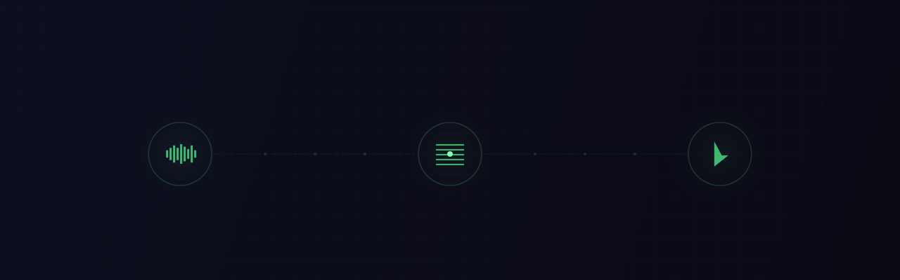
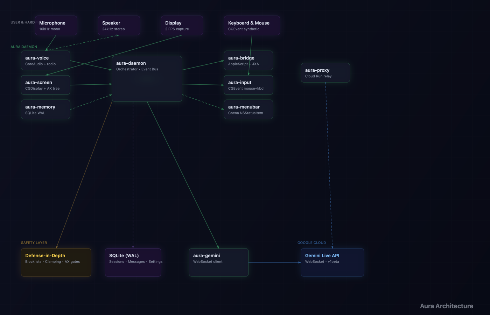

<div align="center">


# Aura

**Your Mac, voice-controlled.**

[](https://www.apple.com/macos/)
[](https://www.rust-lang.org)
[](https://ai.google.dev/)
[](LICENSE)

[](https://github.com/abdul-abdi/aura/releases/latest/download/Aura-1.1.0.dmg)

</div>

<br/>

<div align="center">


[Watch full 60s video →](assets/promo.mp4)
</div>

<br/>

You're deep in work. Twelve tabs open, three apps side by side, a document you need to reference while typing into another window. You reach for the mouse, click, switch, scroll, copy, switch back, paste. Repeat. All day.

**What if you could just say it?**

> *"Open Safari and go to the project board."*
>
> *"Take a look at my screen and summarize what's going on."*
>
> *"Move the mouse to that submit button and click it."*
>
> *"Press Cmd+Shift+4 and take a screenshot."*

Aura is an AI that lives in your menu bar. It hears you, sees your screen, and acts — moving the mouse, typing, clicking, running scripts — all through natural conversation. No keyboard shortcuts to memorize. No workflow apps to configure. Just talk.

---

<div align="center">

</div>

## How it works

A small green dot appears in your menu bar. That's Aura, always listening.

When you speak, your voice streams in real-time to Google's Gemini Live API. Aura simultaneously watches your screen at 2 frames per second, so it always knows what you're looking at. When Gemini decides to act, it calls one of Aura's 12 native tools — and your Mac responds instantly.

The entire pipeline — voice capture, screen analysis, tool execution — runs as native Rust. No Electron. No browser. No latency from web tech. Just raw speed on bare metal macOS.

## What Aura can do

| | Capability | How it works |
|---|---|---|
| **Talk** | Real-time voice conversation | 16kHz capture, 24kHz playback, barge-in detection |
| **See** | Understands your screen | 2 FPS capture with change detection, reads UI elements and accessibility labels |
| **Click** | Precise mouse control | Move, click (left/right, single/double/triple), scroll, drag |
| **Type** | Keyboard automation | Type text, press shortcuts (Cmd+C, Cmd+V, etc.), special keys |
| **Script** | AppleScript & JXA | Control any macOS app — open files, switch tabs, manage windows |
| **Search** | Live web answers | Google Search grounding for real-time facts, weather, news |
| **Remember** | Persistent memory | SQLite-backed session history across restarts |
| **Protect** | Defense-in-depth safety | Pattern blocklists, input clamping, obfuscation detection |

## Example commands

```
"Open Finder and go to my Downloads folder."
"What app am I looking at right now?"
"Click the blue button in the top right."
"Type 'meeting notes' into the search bar and press Enter."
"Open Terminal and run ls -la."
"Drag that file to the Desktop."
"Press Cmd+Z to undo."
"Close this window."
```

---

## Get started

**1. Download and install**

> [](https://github.com/abdul-abdi/aura/releases/latest/download/Aura-1.1.0.dmg)
>
> Open the DMG, drag Aura to Applications, launch it.

**2. Get a Gemini API key**

> Grab a free key from [Google AI Studio](https://aistudio.google.com/apikey). Paste it into Aura's welcome screen.

**3. Grant permissions**

> Aura needs three macOS permissions to function:
>
> | Permission | Why |
> |---|---|
> | Microphone | To hear your voice |
> | Screen Recording | To see your screen |
> | Accessibility | To control mouse and keyboard |
>
> The app walks you through granting each one on first launch.

**4. Start talking**

> The green dot appears in your menu bar. You're live.

---

## Architecture

9 Rust crates, each with one job:

<div align="center">

</div>

| Crate | Purpose |
|---|---|
| `aura-daemon` | Orchestrator — event bus, tool dispatch, session management |
| `aura-gemini` | WebSocket client for Gemini Live API |
| `aura-voice` | CoreAudio capture + rodio playback |
| `aura-screen` | Screen capture, change detection, accessibility tree |
| `aura-bridge` | AppleScript/JXA execution with safety blocklists |
| `aura-input` | CGEvent synthetic mouse + keyboard |
| `aura-memory` | SQLite persistence (WAL mode) |
| `aura-menubar` | Cocoa FFI — NSStatusItem, NSPopover, context menu |
| `aura-proxy` | Cloud Run WebSocket relay (optional) |

## Build from source

```bash
git clone https://github.com/abdul-abdi/aura.git && cd aura
bash scripts/bundle.sh
open target/release/Aura.app
```

Requires Rust 1.85+ and Xcode Command Line Tools.

## Documentation

| Document | What's inside |
|---|---|
| [Getting Started](docs/GETTING_STARTED.md) | Installation, configuration, permissions, troubleshooting |
| [Architecture](docs/ARCHITECTURE.md) | Crate map, threading model, data flow, IPC protocol |
| [Tools Reference](docs/TOOLS.md) | All 12 tools — parameters, examples, security gates |
| [Security Model](docs/SECURITY.md) | Threat model, 5 defense layers, honest gaps |

## Safety

Aura runs AI-generated actions on your machine. We take that seriously.

Every script passes through **pattern blocklists** that catch destructive commands (`rm -rf`, `sudo`, `mkfs`, and more). Every input is **clamped** to safe ranges. **Obfuscation detection** catches commands split across variables. And a **destructive action guardrail** requires confirmation before anything that permanently destroys data.

Full details: [Security Model](docs/SECURITY.md)

---

<div align="center">

[](https://github.com/abdul-abdi/aura/releases/latest/download/Aura-1.1.0.dmg)

Requires macOS 14+ and a free [Gemini API key](https://aistudio.google.com/apikey).

[Apache-2.0 License](LICENSE)

</div>
