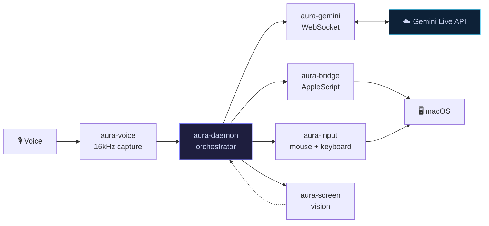

<div align="center">

# Aura

**Voice-first AI desktop companion for macOS.**

Talk to it. It sees your screen. It controls your computer.

[](https://www.rust-lang.org)
[](https://developer.apple.com/swift/)
[](https://www.apple.com/macos/)
[](https://ai.google.dev/)
[](LICENSE)
[](#)

<br/>

<!-- DEMO: screenshot or gif of Aura in action -->
<!-- Replace with:  -->

*Real-time voice + vision + computer control. Native Rust. No Electron.*

</div>

---

## What is Aura?

Aura is a native macOS desktop agent powered by the Gemini 2.5 Flash Live API. It listens to your voice, watches your screen in real time, and takes action — moving the mouse, typing, running AppleScript — all through natural conversation. Built entirely in Rust with zero web tech in the loop.

---

## How It Works



> Full architecture diagram: [`docs/architecture.mmd`](docs/architecture.mmd)

---

## Features

| | Feature | Detail |
|---|---|---|
| 🎙 | **Real-time voice** | 16kHz in, 24kHz out, barge-in detection with RMS energy gating |
| 👁 | **Screen understanding** | 2 FPS capture with FNV-1a change detection, auto-trigger after tool use |
| 🖱 | **9 control tools** | `move_mouse`, `click`, `scroll`, `drag`, `type_text`, `press_key`, `run_applescript`, `get_screen_context`, `shutdown_aura` |
| 🔒 | **Defense-in-depth** | Pattern blocklists, obfuscation detection, input clamping |
| 🔄 | **Session resumption** | Reconnect without losing context, exponential backoff + jitter |
| 🟢 | **Menu bar UI** | 5-color status dot — listening, reconnecting, error, disconnected, pulsing |
| 💾 | **Persistent memory** | SQLite WAL-mode storage for sessions, messages, and settings |
| ☁️ | **Cloud relay** | Optional Cloud Run WebSocket proxy for NAT traversal |

---

## Quick Start

**Prerequisites:** Rust 1.85+, macOS 13+, [Gemini API key](https://aistudio.google.com/apikey)

```bash
# 1. Clone
git clone https://github.com/abdul-abdi/aura.git && cd aura

# 2. Build
cargo build --release -p aura-daemon

# 3. Run
GEMINI_API_KEY=your-key cargo run -p aura-daemon

# 4. Grant permissions when prompted:
#    Microphone → Screen Recording → Accessibility
```

Or bundle as a macOS app:

```bash
bash scripts/bundle.sh    # → target/release/Aura.app
```

> Full setup guide: [`docs/GETTING_STARTED.md`](docs/GETTING_STARTED.md)

---

## Architecture

9 Rust crates, each with a single responsibility:

| Crate | Role |
|---|---|
| `aura-daemon` | Tokio orchestrator, event bus, tool dispatch |
| `aura-gemini` | WebSocket client, Gemini Live API protocol |
| `aura-voice` | CoreAudio capture (16kHz) + rodio playback (24kHz) |
| `aura-screen` | CGDisplay capture, JPEG encoding, change detection |
| `aura-bridge` | AppleScript/JXA execution with pattern blocklists |
| `aura-input` | CGEvent synthetic mouse + keyboard |
| `aura-memory` | SQLite persistence (sessions, messages, settings) |
| `aura-menubar` | Cocoa FFI — NSStatusItem, NSPopover, context menu |
| `aura-proxy` | Axum WebSocket relay for Cloud Run |

---

## Security

Aura runs AI-generated code on your machine. Safety is non-negotiable.

- **Pattern blocklists** — blocks `rm -rf`, `sudo`, `dd if=`, `chmod 777`, `diskutil erase`, and [more](docs/SECURITY.md)
- **JXA hardening** — blocks `$.system`, `ObjC.import`, `.doScript()` escape vectors
- **Obfuscation detection** — catches dangerous commands split across string concatenation or variables

> Full security model: [`docs/SECURITY.md`](docs/SECURITY.md)

---

## Documentation

| Document | Description |
|---|---|
| [`docs/GETTING_STARTED.md`](docs/GETTING_STARTED.md) | Setup, configuration, permissions |
| [`docs/SECURITY.md`](docs/SECURITY.md) | Threat model and safety mechanisms |
| [`docs/TOOLS.md`](docs/TOOLS.md) | All 9 tools — schemas, examples, safety notes |
| [`docs/ARCHITECTURE.md`](docs/ARCHITECTURE.md) | Deep dive — crates, threading, data flow |
| [`docs/architecture.mmd`](docs/architecture.mmd) | Full Mermaid architecture diagram |

---

<div align="center">

**Built with Rust + Gemini Live API for <!-- HACKATHON_NAME -->**

[Apache-2.0 License](LICENSE)

</div>
