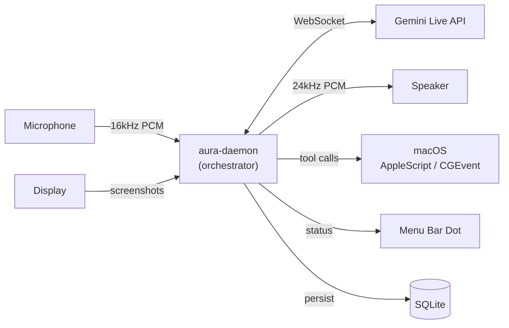
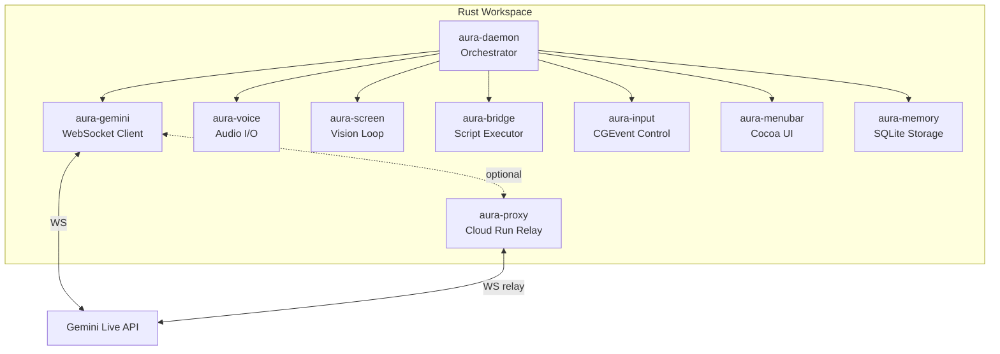
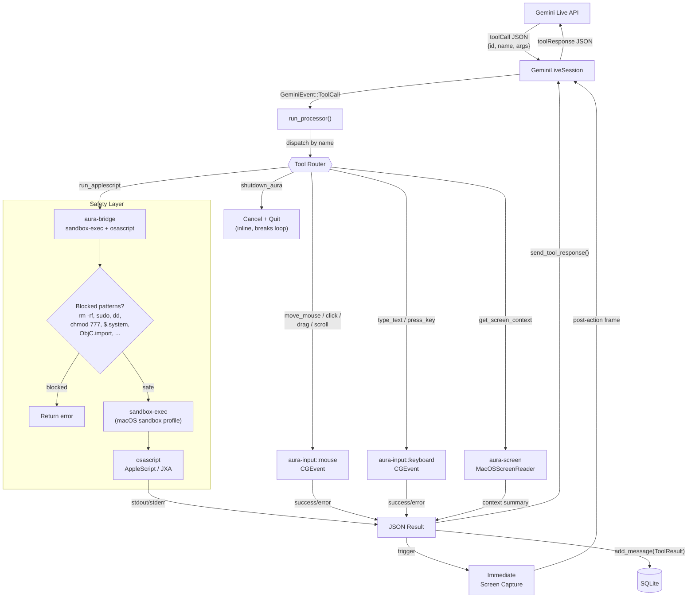
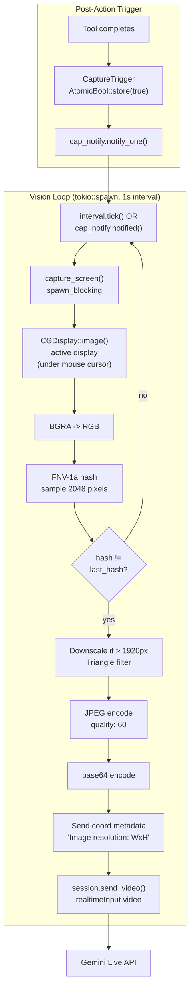
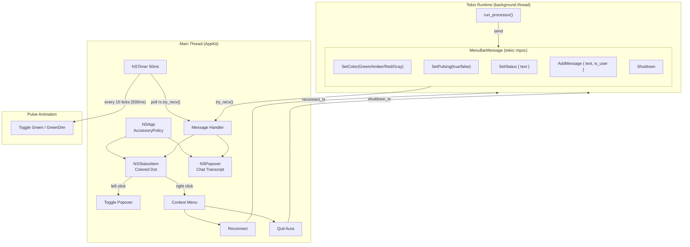
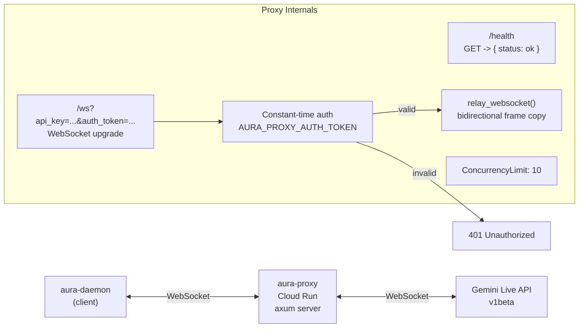
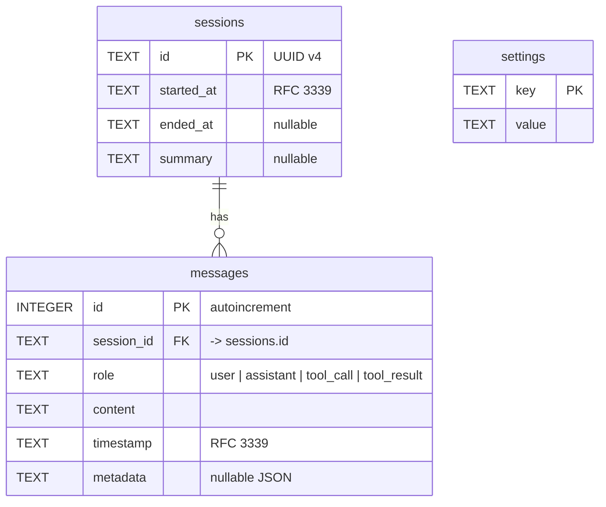
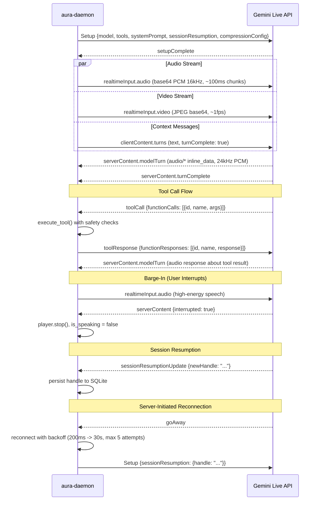
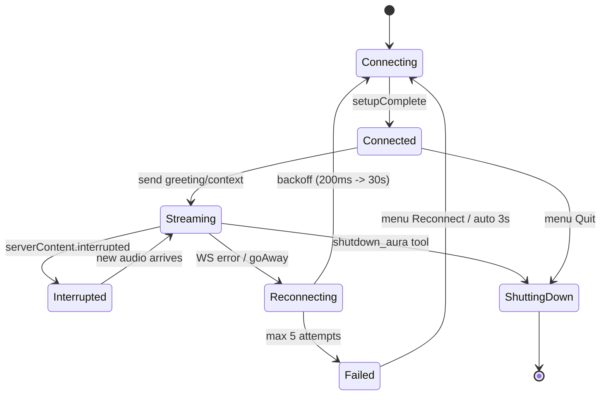

# Aura Architecture

> Voice-first AI desktop companion for macOS, powered by Gemini Live.
> Pure Rust, native Cocoa FFI, no Electron.

## System Overview

---

## Crate Map (9 crates)

---

## 1. Audio Data Flow: Mic to Gemini to Speaker

The audio pipeline is fully bidirectional over a single WebSocket connection. No turn-taking protocol -- the user can interrupt (barge-in) at any time.

```mermaid
flowchart LR
    subgraph CAPTURE["Audio Capture (aura-voice)"]
        MIC["Microphone<br/>cpal"] -->|"48kHz raw"| RESAMPLE["SincFixedIn<br/>Resampler"]
        RESAMPLE -->|"16kHz f32 PCM"| STD_TX["std::sync::mpsc"]
    end

    subgraph BRIDGE["Mic Bridge (aura-daemon)"]
        STD_TX --> TOKIO_RX["tokio::mpsc<br/>cap: 256"]
        TOKIO_RX --> GATE["RMS Energy Gate<br/>threshold: 0.04"]
    end

    subgraph SEND["Gemini Send"]
        GATE -->|"gated PCM"| ENCODE["f32 -> i16 LE<br/>-> base64"]
        ENCODE -->|"realtimeInput.audio"| WS["WebSocket"]
    end

    subgraph RECV["Gemini Receive"]
        WS -->|"serverContent<br/>inline_data audio/*"| DECODE["base64 -> i16 LE<br/>-> f32"]
    end

    subgraph PLAYBACK["Audio Playback (aura-voice)"]
        DECODE -->|"24kHz f32"| PREBUF["PreBuffer<br/>~80ms jitter"]
        PREBUF --> SINK["rodio::Sink<br/>dedicated thread"]
        SINK --> SPEAKER["Speaker"]
    end

    %% Barge-in path
    GATE -.->|"high energy<br/>while speaking"| BARGEIN["Barge-In"]
    BARGEIN -.->|"sink.stop()"| SINK
```

### Key details (verified from source)

| Parameter | Value | Source |
|-----------|-------|--------|
| Capture rate | 48kHz preferred, resampled to 16kHz | `aura-voice/src/audio.rs` |
| Resampler | `rubato::SincFixedIn`, chunk size 1024 | `aura-voice/src/audio.rs` |
| Output rate | 24,000 Hz PCM 16-bit LE | `aura-gemini/src/session.rs` |
| Pre-buffer | 80ms (~1920 samples at 24kHz) | `aura-voice/src/playback.rs` |
| Mic bridge capacity | 256 chunks (bounded) | `aura-daemon/src/main.rs` |
| Barge-in threshold | 0.04 RMS energy | `aura-daemon/src/main.rs` |
| Encoding | f32 -> i16 LE -> base64 (send), reverse (recv) | `aura-gemini/src/session.rs` |

---

## 2. Tool Execution Flow: Gemini Decides, macOS Acts

Gemini declares 9 tools at session setup. When it decides to act, it sends a `toolCall` message. Tools execute concurrently (semaphore limit: 8) and return JSON results.

### The 9 Declared Tools

| Tool | Crate | Mechanism |
|------|-------|-----------|
| `run_applescript` | aura-bridge | `sandbox-exec` + `osascript` with safety checks |
| `get_screen_context` | aura-screen | Frontmost app, windows, clipboard via osascript |
| `shutdown_aura` | aura-daemon | Cancels session, sends Shutdown event |
| `move_mouse` | aura-input | `CGEvent::new_mouse_event` (MouseMoved) |
| `click` | aura-input | `CGEvent` LeftMouseDown/Up or RightMouseDown/Up |
| `type_text` | aura-input | `CGEvent` keyboard events, UTF-16 per char |
| `press_key` | aura-input | `CGEvent` with modifier flags (cmd/shift/alt/ctrl) |
| `scroll` | aura-input | `CGEvent::new_scroll_event` (pixel units) |
| `drag` | aura-input | `CGEvent` MouseDown -> MouseDragged -> MouseUp |

---

## 3. Continuous Vision Loop: Screenshot Change Detection

The daemon captures the screen at ~1 FPS and sends changed frames to Gemini as JPEG. Tool completions trigger immediate captures so Gemini sees the result.

### Frame pipeline parameters

| Step | Detail |
|------|--------|
| Source | `CGDisplay::image()` -- physical (retina) pixels |
| Scale detection | `raw_width / display_bounds.width` for retina factor |
| Max width | 1920px (downscaled with `image::Triangle` filter) |
| JPEG quality | 60 (readability vs. bandwidth tradeoff) |
| Change detection | FNV-1a hash over 2048 sampled pixel positions |
| Frame rate | ~1 FPS (1-second `tokio::time::interval`) |
| Immediate capture | `CaptureTrigger` + `Notify` after tool execution |

---

## 4. Menu Bar UI: Native Cocoa on Main Thread

The menu bar runs on the main thread (required by AppKit). Communication with the tokio runtime happens via `tokio::mpsc` channels, polled by an NSTimer every 50ms.

### Status dot colors

| Color | Meaning |
|-------|---------|
| Green (pulsing) | Connected, listening |
| Amber | Running a tool / reconnecting |
| Red | Error (connection failure, mic permission) |
| Gray | Disconnected |

---

## 5. Cloud Run Proxy Relay

For region-restricted Gemini API access, the optional `aura-proxy` crate runs on Google Cloud Run as a transparent WebSocket relay.

---

## 6. SQLite Memory Storage

Session data persists in `~/.local/share/aura/aura.db` using WAL mode for concurrent read/write.

### Storage operations

| Operation | When |
|-----------|------|
| `start_session()` | New connection (UUID v4) |
| `add_message()` | Every tool call, tool result, greeting context |
| `set_setting("resumption_handle")` | On `SessionResumptionUpdate` from Gemini |
| `end_session()` | On `GeminiEvent::Disconnected` |
| `prune_old_sessions(days)` | Manual cleanup |
| `vacuum()` | Reclaim disk space post-prune |

---

## 7. WebSocket Protocol Detail

---

## 8. Thread Model

| Thread/Task | Crate | Runtime | Purpose |
|-------------|-------|---------|---------|
| **Main thread** | aura-menubar | AppKit | NSApp.run(), NSStatusItem, NSPopover |
| **aura-mic-capture** | aura-voice | std::thread | cpal audio input (Stream is !Send) |
| **aura-playback** | aura-voice | std::thread | rodio OutputStream (!Send) |
| **tokio runtime** | aura-daemon | tokio | Event processor, mic bridge, vision loop |
| **mic bridge** | aura-daemon | spawn_blocking | Drains std::sync::mpsc -> tokio::mpsc |
| **vision loop** | aura-screen | tokio::spawn | 1fps capture + change detection |
| **tool tasks** | aura-daemon | tokio::spawn | Concurrent tool execution (semaphore: 8) |
| **connection_loop** | aura-gemini | tokio::spawn | WebSocket send/recv + reconnection |

---

## 9. Reconnection & Resilience

| Parameter | Value |
|-----------|-------|
| Initial backoff | 200ms |
| Max backoff | 30,000ms |
| Max attempts | 5 (per connection_loop) |
| Stable connection threshold | 30s (resets attempt counter) |
| Jitter | Deterministic +/-25% based on attempt number |
| Outer reconnect | Auto-retry after 3s or manual via menu |
| Session resumption | Handle persisted in SQLite, sent on reconnect |
| Context window | Sliding window compression enabled |
